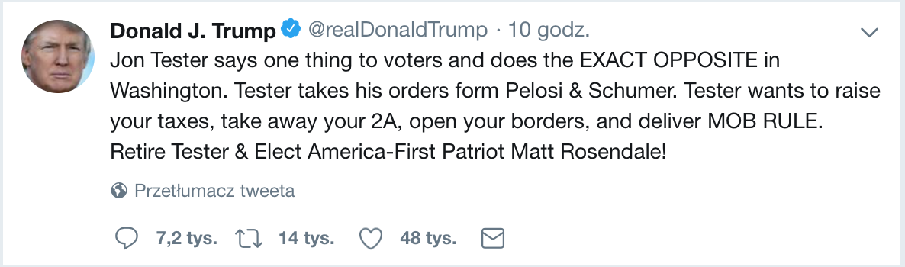
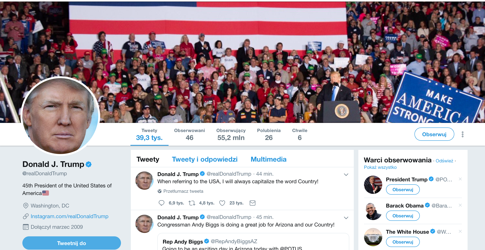
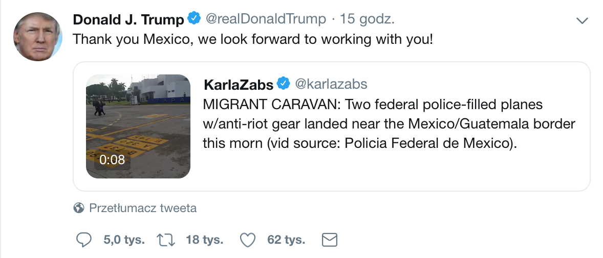

```{r global_options, include = FALSE}
# Do not bother with this chunk because it only defines some visual options for other chunks
knitr::opts_chunk$set(echo = FALSE,
                      warning = FALSE,
                      message = FALSE,
                      include = FALSE,
                      fig.align = "center",
                      fig.height = 3,
                      fig.width = 3,
                      verbose = FALSE)
    
```

```{r load_packages}
library(jsonlite)
library(tidyverse)
library(magrittr)
library(quanteda)
library(stringr)
library(RColorBrewer)
library(lubridate)
library(rtweet)
library(tidytext)
library(shiny)
```

## Ściąganie tweetów

Nie wiem na ile używasz Twittera i znasz jego infrastrukturę. Poniżej na przykładzie Przywódcy Wolnego Świata krótkie omówienie rzeczy, które można wyciągnąć z Twittera. Zacznijmy od tego, że tak naprawdę są dwie podstawowe możliwości dostępu do tweetów. Po pierwsze można ściągać je na bieżąco, po drugie można ściągać historyczne tweety.

* `stream_tweets` - tweety można wyszukiwać na trzy sposoby: po słowach kluczowych (do 400 słów), po unikalnych numerach użytkowników (do 5000 użytkowników), po lokalizacji (mało użyteczne bo jednak spora część ludzi nie udostępnia lokalizacji - głupi ludzie).

* `search_tweets` - można ściągać tweety po słowach kluczowych (do 500 znaków) i po lokalizacji. Można wyszukać tweety do 10 dni wstecz, jednak i tak nie będą to wszystkie tweety tylko część. Ciężko powiedzieć jaka.

Poza tymi dwoma podstawowymi sposobami można wyciągać jeszcze informacje dotyczące relacji łączących użytkowników. Niestety, jest trochę ograniczeń z tym związanych, które powodują, że np. porównanie zbioru osób obserwujących FOX News i CNN zajmie ze dwa tygodnie...

## Twitter

Nie wiem na ile wiesz czym się na przykład różni quote od retweeta. Dlatego poniżej przy okazji tego co można wyciągnąć z Twittera trzy podstawowe typy tweetów: tweet, retweet i quote

### tweet

Tak naprawdę w Twitterowej dokumentacji próżno szukać słowa tweet, to co wszyscy nazywają tweetem jest tam określane mianem statusu. Jednak ja dalej będę zawsze pisał tweet, bo jest mi po prostu tak wygodniej. Poniżej więc przykład tego jak wygląda tweet z poziomu zwykłego użytkownika.

   


To co widać powiedziałbym, że nie jest specjalnie ciekawe i nie jest też tego za dużo. To co jest już ciekawsze można bez trudu wyciągnąć z API:   

* `user_id` - unikalny numer użytkownika. W tym przypadku jest to $25073877$. Przydatne jak się chce sprawdzać co innego dany użytkownik napisał.  

* `status_id` - unikalny numer tweeta. Każdy tweet ma swój oddzielny numer niezależnie od tego czy jest tweetem, retweetem czy quotem, ale o tym za moment. W tym przypadku jest to $1053121500151074817$.

* `created_at` - moment w którym dany tweet został zatweetowany. W przypadku retweeta jest to moment, w którym dany tweet został zretweetowany; nie ma znaczenia kiedy powstał oryginalny tweet. Tutaj jest tylko napisane, że powstał 10 godzin temu, ale przez API dostaję co do sekundy datę powstania - 2018-10-19\ 03:11:46.

* `screen_name` - nazwa użytkownika, która musi być unikalna. W tym przypadku jest to `@realDonaldTrump`. Jeśli chodzi o Trumpa to to jest dość ciekawe, bo On ma swoje "prywatne" konto `@realDonaldTrump` oraz konto Prezydenta Stanów Zjednoczonych `@POTUS`. Normalnie używa swojego prywatnego konta, a to służbowe jest prowadzone chyba przez kogoś innego. W związku z tym na tych kontach nie ma tego samego; to służbowe nie pisze aż takich głupot jak prywatne, ale oczywiście nikt na nie nie zwraca uwagi. Ciekawe jest to, że służbowe konto po tym jak Trump przestanie być prezydentem zmieni `screen_name` na `@POTUS45`. Tak było np. z Obamą, który założył konto `@POTUS`, a po tym jak przestał być prezydentem to Twitter stworzył Mu konto `@BarackObama`. Jego dotychczasowe tweety zostały zarchiwizowane na koncie `@POTUS44`. Ze wszystkimi poprzednimi prezydentami było tak samo.

* `name` - nazwa użytkownika. W tym przypadku jest to `Donald J. Trump`.

* `text` - treść tweeta. To pole jak rozumiem będzie nas najbardziej interesować. 

* `lang` - język, w którym napisany jest tweet. Jest automatycznie rozpoznawany przez Twittera.

* `source` - jaki klient został wykorzystany do stworzenia tweeta. Można w miarę dokładnie powiedzieć nie tylko czy użyto strony internetowej czy smartfona, ale też czy był to telefon z Androidem czy IOSem. W tym przypadku był to Trumpa iPhone, którego najczęściej używa do tweetowania, choć czasem używa też komputera. Z ostatnich 100 Jego tweetów 95 było z iPhone'a, a tylko 5 z komputera przy użyciu Media Studio, które służy do zarządzania wieloma kontami. Można więc wnioskować, że niekoniecznie napisał go przy pomocy swoich małych dłoni.

* `is_quote` - czy ten tweet to jest cytat. W tym przypadku odpowiedź brzmi nie.   

* `is_retweet` - czy ten tweet jest retweetem. W tym przypadku odpowiedź brzmi nie.

* `favorite_count` - liczba polubień. Na zdjęciu jest tylko przybliżona wartość, jak je robiłem to nie sprawdziłem od razu ile jest ich naprawdę, a jak sprawdziłem przez API w sobotę to było ich już $69636$.

* `retweet_count` - liczba razy ten tweet był retweetowany. Tak samo jak w przypadku liczby polubień jest tylko przybliżona i też jej nie sprawdziłem od razu w API, w sobotę było to już $20628$.

* `media_type` - format załącznika jeśli oczywiście jest, tzn. czy jest to zdjęcie, film itp. W tym przypadku to pole jest puste. Można wyciągnąć też link do tego załącznika.   

* `mentions_user_id` - unikalne numery użytkowników, którzy zostali wspomniani w tym tweecie. W tym przypadku nikt nie został wspomniany. Tutaj warto wspomnieć o dwóch różnych zachowaniach użytkowników z których może wynikać to, że jakiś inny użytkownik jest wspomniany w tweetcie: tweet jest odpowiedzią na czyjś tweet lub jest wywołaniem kogoś.

* `mentions_screen_name` - nazwy użytkowników, którzy zostali wspomniani w tweecie.  

* `reply_to_user_id` - unikalny numer użytkownika do którego tweeta jest to odpowiedź.

* `reply_to_status_id` - unikalny numer tweeta, do którego ten tweet jest odpowiedzią.

* `reply_to_screen_name` - unikalna nazwa użytkownika do którego to jest odpowiedź.

* `geo_coords`, `coords_coords` i `bbox_coords` - to są potencjalnie ciekawe dane za pomocą, których można wyszukiwać tweety z danego miejsca. Jednak w większości ludzie mają wyłączoną lokalizację, więc moim zdaniem wyszukiwania tweetów po lokalizacji mija się z celem, bo dostaje się tylko tweety tych ludzi, którzy pozwalają na lokalizację.

Ściągając przez API jednego tweeta dostaje się nie tylko informacje dotyczące samego tweeta, ale też mnóstwo informacji na temat użytkownika, który go stworzył. Poniżej to jak wygląda profil konta Przywódcy Wolnego Świata z poziomu zwykłego użytkownika.

   


Tak jak w przypadku tweeta, to co widać nie jest przesadnie ciekawe, dużo ciekawsze jest to co zwraca API:

* `verified` - czy konto jest zweryfikowane. Osoby publiczne i dziennikarze często mają zweryfikowane konta, ale nie jest to regułą. Z tego co wiem to Twitter daje Ci możliwość weryfikacji konta, a nie że się o to aplikuje. W przypadku Donalda Trumpa ma On zweryfikowane konto co widać po niebieskim znaczku obok nazwiska.

* `followers_count` - liczba osób obserwujących profil użytkownika. Tak jak w przypadku tweeta na zdjęciu widać mniej niż w API, które podaje dokładną liczbę - $55246656$.

* `friends_count` - liczba osób, które profil obserwuje. Dobrze wiedzieć, że Twitter nakłada ograniczenia na liczbę osób, które można obserwować - jest to maksymalnie 5 tysięcy kont. W tym przypadku Trump obserwuje tylko 46 osób (FOX and Family).

* `listed_count` - liczba list, których użytkownik jest członkiem. Do listy można samemu dołączyć, albo zostać dołączonym przez innego użytkownika. Tak naprawdę listy nie mają żadnego znaczenia, bo głównie służą do uporządkowania wyświetlających się tweetów. W tym przypadku jest to $94936$.

* `statuses_count` - liczba tweetów stworzonych przez użytkownika (retweety też się wliczają). W tym przypadku jest to $39353$.

* `favorites_count` - liczba polubionych tweetów. W tym przypadku jest to $26$.

* `accounts_created_at` - kiedy konto zostało stworzone. Na zdjęciu jest tylko przybliżona data z API można wyciągnąć datę co do sekundy - 2009-03-18 13:46:38.

* `account_lang` - język w jakim konto jest używane. Może to być o tyle ciekawa informacja, że tak naprawdę w jakimś stopniu mówi na temat tego jaki jest pierwszy język użytkownika i w jakim języku ma ustawiony telefon czy komputer. Na przykład Tusk, który ma dwa konta: jedno oficjalne `@europresident`, a drugie `@donaldtusk` w obu ma ustawiony język konta jako angielski. Mimo że tak naprawdę na jednym tweetuje po angielsku, a na drugim po polsku. Choć jeśli chodzi o konto prywatne to tweetuje tylko z iPhone'a, a z oficjalnego z różnych urządzeń. Stąd można wysnuć wniosek, że nie zawsze tweety od `@europresident` pochodzą od Donalda Tuska, prawdopodobnie część z nich jest pisana przez kogoś innego.

* `profile_banner_url` - link do zdjęcia w tle. W tym przypadku link do zdjęciach jest [tutaj.](https://pbs.twimg.com/profile_banners/25073877/1540018811)

* `profile_image_url` - link do zdjęcia profilowego. W tym przypadku link do zdjęcia jest [tutaj.](http://pbs.twimg.com/profile_images/874276197357596672/kUuht00m_normal.jpg)

* `url` - link podany przez użytkownika. W tym przypadku jest to link do profilu Trumpa na [Instagramie.](http://www.Instagram.com/realDonaldTrump)

* `location` - miejsce podane przez użytkownika. W tym przypadku jest to Waszyngton, DC. Wiesz, że jest też stan Waszyngton i jest on na zachodnim wybrzeżu?

* `description` - informacje podane przez użytkownika. W tym przypadku jest to "45th President of the United States of America🇺🇸"
* `place_name`, `place_type`, `country`, `country_code` - teoretycznie to powinny być ciekawe dane dotyczące miejsca czy kraju pochodzenia profilu, ale jest to wpisane przez użytkownika, więc rzadko kiedy jest tutaj wpisane coś ciekawego.

* `protected` - czy konto jest ogólnie dostępne czy nie. Jeśli konto jest chronione to znaczy, że nie da się ściągnąć z niego tweetów, chyba, że profil na którym jest postawiona aplikacja obserwuje dane konto (w naszym przypadku Andrzej nikogo nie obserwuje, więc jest dostęp tylko do kont publicznych). Jednak tak naprawdę kont prywatnych wcale nie jest dużo, większość jest publicznych ogólnie dostępnych. To jest ogólnie dość ciekawe, bo na Twitterze można ludzi blokować tak, że nie widzą tworzonych przez nas tweetów. Jednak jakoś ostatnio Sąd Federalny orzekł, że Trump jako Przywódca Wolnego Świata i Prezydent Stanów Zjednoczonych nie może blokować użytkowników, bo w ten sposób ograniczałby dostęp do informacji publicznej.

### retweet

Jest to podanie czyjegoś tweeta osobom, które obserwują nasze konto, a niekoniecznie obserwjuą konto osoby, która napisała oryginalnego tweeta. Często użytkownicy w opisach swoich profili mają napisane, że retweet nie oznacza poparcia. Poniżej przykład.


W przypadku retweeta dostajemy wszystkie te same informacje, które poprzednio dostaliśmy o tweecie. Jednak Twitter retweet uznaje jako tweet, więc np. `created_at` będzie to moment, w którym Trump retweetował tego tweeta. Tak samo będzie z `name` czy też `source`. Szczęśliwie Twitter dostarcza też informacje o oryginalnym tweecie U.S. Marines: `retweet_created_at`, `retweet_screen_name`, `retweet_source` i `retweet_status_id`. Poza tym dostajemy też trochę informacji na temat konta U.S. Marines: `retweet_user_id`, `retweet_statuses_count`, `retweet_followers_count`, `retweet_friends_count` i `retweet_description`. Moim zdaniem jedyna ciekawa rzecz, której nie dostajemy to język w jakim prowadzone jest konto U.S. Marines. Można to wyciągnąć ale już bezpośrednio z konta U.S. Marines co przy większej liczbie użytkowników jest czasochłonne.

### quote

Jest to tak naprawdę podanie dalej czyjegoś tweeta wraz z własnym komentarzem. Przykład poniżej.




Dla Twittera tak naprawdę quote nie różni się za bardzo od zwykłego tweeta. Przez API dostajemy wszystkie możliwe informacje na temat tweeta Przywódcy Wolnego Świata i jego konta. Dodatkowo dostajemy też trochę informacji na temat cytowanego tweeta: `quoted_text`, `quoted_created_at`, `quoted_screen_name`, `quoted_source`, `quoted_status_id`, `quoted_favorite_count`, `quoted_retweet_count`. Poza tym dostajemy też trochę informacji na temat konta Karli Zabs: `quoted_user_id`, `quoted_statuses_count`, `quoted_followers_count`, `quoted_friends_count`, `quoted_description` i `retweet_favorites_count`. Tak samo jak w przypadku retweeta brakuje jedynie infromacji na temat języka w jakim prowadzone jest konot Karli Zabs.

## Kler

Tak jak napisałem w mailu. Zebrałem trochę historycznych tweetów i zacząłem też ściągać tweety na bieżąco. W obu przypadkach wyszukuje tweety po następujących słowach kluczowych: `r read.csv2("../../words.csv") %$% word`. Tzn. poprzednie zdanie jest prawie prawdziwe bo dopiero w ściąganiu na bieżąco dodałem polexit i POLEXIT. Już dawno chciałem to ściągać, ale jakoś nie było okazji. To co jest poniżej dotyczy tylko tweetów historycznych o klerze.

### Przetwarzanie danych

Ogólnie zebrałem $131178$ tweetów, jednak  przez to, że dostęp do historycznych tweetów jest ograniczony kilkukrotnie zebrały się te same. Jest to  spowodowane tym, że Twitter nie bardzo chce dawać dostęp do historycznych tweetów, bo chce na tym zarabiać. Po przefiltrowaniu powtarzających się tweetów zostało ich $48305$, z czego $29867$ to retweety.

```{r load_data, cache = TRUE}
kler <- stream_in(file("../../data/kler.jl")) %>%
  distinct(status_id,.keep_all = TRUE) %>%
  mutate(id = status_id) %>%
  corpus(text_field = "text",
         docid = "id")
```

Drugim filtrem, który zastosowałem było wybranie tylko tych słów, które rzeczywiście nas interesują. Przez takie a nie inne ustawienia słów kluczowych zebrały się też tweety dotyczące na przykład Marka Jakubiaka - kandydata na prezydenta Warszawy z Kukiz15 czy też rocznicy śmierci księdza Jerzego Popiełuszki. Innymi słowy jest więcej tweetów niż potrzeba, dlatego z tych $48305$ przefiltrowałem na razie tylko te, które explicite dotyczą kleru czyli zawierają słowa: kler, ksiądz, księża, ks., biskup, arcybiskup, kościół, kosciol, ksiadz, ksieza, smarzowski, gajos, kulik, jakubik, braciak, wieckiewicz i więckiewicz.

```{r corpus_select}
WORDS <- c("kler",
           "ksiądz",
           "księża",
           " ks.",
           "biskup",
           "arcybiskup",
           "kościół",
           "kosciol",
           "ksiadz",
           "ksieza",
           "smarzowski",
           "gajos",
           "kulik",
           "jakubik",
           "wieckiewicz",
           "więckiewicz",
           "braciak")

kler_id <- kler %>%
  kwic(pattern = WORDS,
       case_insensitive = TRUE) %$%
  docname

kler <- kler %>% 
  corpus_subset(status_id %in% kler_id)

tokens <- kler %>%
  tokens(what = "word",
         remove_numbers = TRUE,
         remove_punct = TRUE,
         remove_symbols = TRUE,
         remove_separators = TRUE,
         remove_twitter = TRUE,
         remove_url = TRUE,
         include_docvars = TRUE)
```

### Przykłady

```{r examples}
most_likes <- kler %>%
  docvars() %>%
  arrange(desc(favorite_count)) %>%
  slice(1) %$%
  status_id

most_retweets <- kler %>%
  docvars() %>%
  arrange(desc(retweet_count)) %>%
  slice(1) %$%
  status_id
```

Tak, żebyś miała jakikolwiek obraz tego jak te tweety wyglądają to poniżej są dwa przykładowe tweety z tych zebranych: pierwszy to tweet o największej liczbie polubień, a drugi o największej liczbie retweetów.

Tweet o największej liczbie polubień - `r kler %>% docvars() %>% filter(status_id == most_likes) %$% favorite_count`:

> `r kler %>% corpus_subset(status_id %in% most_likes) %>% texts()`

Poniżej podstawowe informacje zarówno na temat tego tweeta jak i osoby, która go stworzyła. Najpierw podstawowe informacje dotyczące samego tweeta:

* `created_at` - `r kler %>% docvars() %>% filter(status_id == most_likes) %$% created_at`
* `name` - `r kler %>% docvars() %>% filter(status_id == most_likes) %$% name`
* `source` - `r kler %>% docvars() %>% filter(status_id == most_likes) %$% source`
* `retweet_count` - `r kler %>% docvars() %>% filter(status_id == most_likes) %$% retweet_count`
* `is_retweet` - `r kler %>% docvars() %>% filter(status_id == most_likes) %$% is_retweet`
* `is_quote` - `r kler %>% docvars() %>% filter(status_id == most_likes) %$% is_quote`

Podstawowe informacje na temat użytkownika:

* `account_created_at` - `r kler %>% docvars() %>% filter(status_id == most_likes) %$% account_created_at`
* `account_lang` - `r kler %>% docvars() %>% filter(status_id == most_likes) %$% account_lang`
* `statuses_count` - `r kler %>% docvars() %>% filter(status_id == most_likes) %$% statuses_count`
* `followers_count` - `r kler %>% docvars() %>% filter(status_id == most_likes) %$% followers_count`
* `friends_count` - `r kler %>% docvars() %>% filter(status_id == most_likes) %$% friends_count`
* `description` - `r kler %>% docvars() %>% filter(status_id == most_likes) %$% description`
* `favorites_count` - `r kler %>% docvars() %>% filter(status_id == most_likes) %$% favorite_count`

Tweet najczęściej retweetowany - `r kler %>% docvars() %>% filter(status_id == most_retweets) %$% retweet_count`:

> `r kler %>% corpus_subset(status_id %in% most_retweets) %>% texts() %>% str_replace_all(pattern = "\\\n", replacement = " ")`

Poniżej podstawowe informacje zarówno na temat tego tweeta jak i osoby, która go stworzyła. Najpierw podstawowe informacje dotyczące samego tweeta:

* `retweet_created_at` - `r kler %>% docvars() %>% filter(status_id == most_retweets) %$% retweet_created_at`
* `retweet_screen_name` - `r kler %>% docvars() %>% filter(status_id == most_retweets) %$% retweet_screen_name`
* `retweet_source` - `r kler %>% docvars() %>% filter(status_id == most_retweets) %$% retweet_source`
* `retweet_retweet_count` - `r kler %>% docvars() %>% filter(status_id == most_retweets) %$% retweet_retweet_count`

Podstawowe informacje na temat użytkownika:

* `retweet_statuses_count` - `r kler %>% docvars() %>% filter(status_id == most_retweets) %$% retweet_statuses_count`
* `retweet_followers_count` - `r kler %>% docvars() %>% filter(status_id == most_retweets) %$% retweet_followers_count`
* `retweet_friends_count` - `r kler %>% docvars() %>% filter(status_id == most_retweets) %$% retweet_friends_count`
* `retweet_description` - `r kler %>% docvars() %>% filter(status_id == most_retweets) %$% retweet_description`
* `retweet_favorites_count` - `r kler %>% docvars() %>% filter(status_id == most_retweets) %$% retweet_favorite_count`

Widać, więc, że o ile tweet z największą liczbą polubień jest między 7 i 17 października to ten najczęstszy retweet jest z pierwszego weekendu pokazywania kleru w kinach.

### Wykresy

Tak naprawdę to są dość proste wykresy, bo wymyślenie liczenia sentymentu wcale nie jest takie trywialne, tzn. teoretycznie jest LIWC, ale z tego co mi się wydaje to on nie jest taki łatwy w dostępie. Coś postaram się wymyślić. Na razie spokojnie dalej się zbierają tweety.

```{r frequency_plot, include = TRUE, message = FALSE}
kler %>%
  kwic(pattern = WORDS,
       case_insensitive = TRUE,
       window = 1) %>% 
  as_tibble() %>%
  select(status_id = docname, keyword) %>%
  left_join(kler %>% docvars %>% select(status_id, created_at)) %>%
  mutate(keyword = tolower(keyword)) %>%
  mutate(keyword = case_when(keyword == "ksiadz" ~ "ksiądz",
                             keyword == "kosciol" ~ "kościół",
                             keyword == "ksieza" ~ "księża",
                             TRUE ~ keyword),
         created_at = created_at %>% as.character %>% ymd_hms()) %>%
  filter(keyword %in% c("kler", "ksiądz", "księża", "ks.", "biskup", "arcybiskup", "kościół", "smarzowski", "gajos", "kulik", "jakubik", "braciak", "więckiewicz")) %>%
  group_by(keyword) %>%
  ts_plot("12 hours") +
  theme_classic() +
  scale_color_discrete("") +
  labs(x = NULL, y = NULL,
    title = "Częstość tweetów na temat kleru od 7 do 17 października",
    subtitle = "Tweety są zaagregowane w 12 godzinnych interwałach",
    caption = "") 
```

```{r 9_paz}
end <- ymd_hms("2018-10-09 23:59:59")
start <- ymd_hms("2018-10-09 00:00:00")
paz_most_retweets <- kler %>%
  corpus_subset(created_at > start) %>%
  corpus_subset(created_at < end) %>%
  docvars() %>%
  group_by(retweet_status_id) %>%
  summarise(freq = n()) %>%
  filter(!is.na(retweet_status_id)) %>%
  arrange(desc(freq)) %>%
  slice(1) %$%
  retweet_status_id
```

Pierwsza rzecz, która oczywiście rzuca się w oczy to duży pik słowa ksiądz 9 października, zwłaszcza, że to był wtorek. Kler w kinach był już od przeszło tygodnia (premiera 28 września). Poniżej tweet, który był najczęściej retweetowany 9 października:

> `r kler %>% corpus_subset(status_id %in% paz_most_retweets) %>% texts()`

Szczerze mówiąc nie bardzo rozumiem czemu 9 października zrobił aż taką furorę, że został `r kler %>% corpus_subset(created_at > start) %>% corpus_subset(created_at < end) %>% docvars() %>% group_by(retweet_status_id) %>% summarise(freq = n()) %>% filter(!is.na(retweet_status_id)) %>% arrange(desc(freq)) %>% slice(1) %$% freq` razy retweetowany. Nie jest to jakoś przesadnie śmieszne. To jest ten sam tweet, który ma najwięcej polubień między 7 października, a 17. Mimo że ten jeden tweet wyjaśnia ten peak to coś innego musiało się też zdarzyć 9 października, bo on nie jest przesadnie śmieszny. Na pewno za to 7 października została opublikowana ["mapa kościelnej pedofili w Polsce"](http://nielekajciesie.org.pl/news75-Mapa_koscielnej_pedofili_w_Polsce) przez fundacje "Nie lękajcie się", ale nie wydaje mi się, żeby to z tym było związane.

```{r 8_paz}
end8 <- ymd_hms("2018-10-08 23:59:59")
start8 <- ymd_hms("2018-10-08 00:00:00")
paz8_most_retweets <- kler %>%
  corpus_subset(created_at > start8) %>%
  corpus_subset(created_at < end8) %>%
  docvars() %>%
  group_by(retweet_status_id) %>%
  summarise(freq = n()) %>%
  filter(!is.na(retweet_status_id)) %>%
  arrange(desc(freq)) %>%
  slice(1) %$%
  retweet_status_id
```

Druga rzecz, która zwróciła moją uwagę to to, że 8 października mówiło się stosunkowo dużo klerze i jakubiku. Stawiam na to, że związane to było z tym, że to był poniedziałek po drugim weekendzie pokazywania tego filmu, więc pojawiły się wyniki oglądalności. W jakimś stopniu potwierdza to najczęściej retweetowany tweet tego dnia (`r kler %>% corpus_subset(created_at > start8) %>% corpus_subset(created_at < end8) %>% docvars() %>% group_by(retweet_status_id) %>% summarise(freq = n()) %>% filter(!is.na(retweet_status_id)) %>% arrange(desc(freq)) %>% slice(1) %$% freq`)

> `r kler %>% corpus_subset(status_id %in% paz8_most_retweets) %>% texts()`

Ogólnie problem jest tylko taki, że ciężko w przypadku historycznych tweetów opierać się na frekwencji bo nie są to wszystkie tweety z tego okresu, tylko dość losowa ich próbka. Tzn. teoretycznie to powinna być mieszanka napopularniejszych i najświeższych.

To co jeszcze zrobiłem to zaagregowałem tweety po dniach i sprawdziłem z grubsza rozkład słów w nich występujący. Oczywiście trudno wypatrzeć tam coś ciekawego bo tak jak pisałem na samym początku muszę się dobrze zastanowić jak uporać się z językiem polskim... Na razie dość arbitralnie usunąłem słowa, które nic nie wnoszą czyli: `r c("jest", "gdzie", "się", "sie", "tego", "mają", "maja", "ale", "chce","dla", "jednak", "tylko", "niej", "który", "ktory", "albo", "jak", "innego", "całą", "bierze", "wśród", "mimo", "jeśli", "czy", "mnie", "wam", "tym", "całe", "przed", "naprawdę", "wojciech", "dosadniej", "dalej", "każdy", "jego")`

```{r aggregate, include = TRUE, message = FALSE}
tokens %>%
  docvars() %>%
  mutate(created_at = created_at %>% ymd_hms() %>% day) %>%
  select(status_id, created_at) %>%
  left_join(tokens %>% dfm() %>% tidy() %>% rename(status_id = document)) %>%
  filter(nchar(term) > 2) %>%
  group_by(created_at, term) %>%
  summarise(count = sum(count)) %>%
  group_by(created_at) %>%
  mutate(count = count/sum(count)) %>%
  ungroup() %>%
  mutate(term = case_when(term == "ksiadz" ~ "ksiądz",
                          term == "kosciol" ~ "kościół",
                          term == "ksieza" ~ "księża",
                          term == "wieckiewicz" ~ "więckiewicz",
                          TRUE ~ term)) %>%
  anti_join(data_frame(term = c("jest", "gdzie", "się", "sie", "tego", "mają", "maja", "ale", "chce","dla", "jednak", "tylko", "niej", "który", "ktory", "albo", "jak", "innego", "całą", "bierze", "wśród", "mimo", "jeśli", "czy", "mnie", "wam", "tym", "całe", "przed", "naprawdę", "wojciech", "dosadniej", "dalej", "każdy", "jego"))) %>%
  group_by(created_at) %>%
  arrange(desc(count)) %>%
  slice(1:10) %>%
  ggplot(aes(x = term,
             y = count,
             fill = as.factor(created_at))) +
  facet_wrap(~created_at, scales = "free_y") +
  geom_col(show.legend = FALSE) +
  coord_flip() +
  theme_classic() +
  labs(x = NULL, y = NULL,
    title = "Prawdopodobieństwa występowania kluczowych słów w tweetach",
    subtitle = "Tweety zebrane między 7, a 17 października",
    caption = "") 
  
```

Kolejną rzeczą, którą zrobiłem było policzenie inverse document frequency, na podstawie, którego można zobaczyć jakie słowa są specyficzne dla danego dnia. Jest to dość proste bo wzrój jest następujący:

$$idf(word)=ln(\frac{n_{documents}}{n_{document\ contatining\ word}})$$ 
gdzie $n_{documents}$ to liczba dokumentów, a $n_{number\ containing\ word}$ - liczba dokumentów zawirajacych dane słowo.

```{r idf}
tokens %>%
  docvars() %>%
  mutate(created_at = created_at %>% ymd_hms() %>% day) %>%
  select(status_id, created_at) %>%
  left_join(tokens %>% dfm() %>% tidy() %>% rename(status_id = document)) %>%
  filter(nchar(term) > 2) %>%
  group_by(created_at, term) %>%
  summarise(count = sum(count)) %>%
  group_by(created_at) %>%
  ungroup() %>%
  mutate(term = case_when(term == "ksiadz" ~ "ksiądz",
                          term == "kosciol" ~ "kościół",
                          term == "ksieza" ~ "księża",
                          term == "wieckiewicz" ~ "więckiewicz",
                          TRUE ~ term)) %>%
  bind_tf_idf(term = term,
              document = created_at,
              n = count) %>%
  filter(idf==max(idf)) %>%
  select(created_at, term, tf) %>%
  group_by(created_at) %>%
  arrange(desc(tf)) %>%
  slice(1:10) %>%
  ggplot(aes(x = term,
             y = tf,
             fill = as.factor(created_at))) +
  facet_wrap(~created_at, scales = "free_y") +
  geom_col(show.legend = FALSE) +
  coord_flip() +
  theme_classic() +
  labs(x = NULL, y = NULL,
    title = "Prawdopodobieństwo 10 najczęstszych specyficznych słów dla każdego dnia",
    subtitle = "Tweety zebrane między 7, a 17 października",
    caption = "") 

```

Jedyne co można tutaj zobaczyć, a w zasadzie czego nie ma to słowa po których wyszukiwaliśmy. Powiedziałbym, że niewprost pokazuje, że rzeczywiście każdego dnia pojawiały się tweety na temat kościoła czy też kleru.

Tak naprawdę to tego idf używa się do liczenia term frequency inverse document frequency, czyli po prostu liczenia ważonej częstości.

```{r tf_idf}
table <- tokens %>%
  docvars() %>%
  mutate(created_at = created_at %>% ymd_hms() %>% day) %>%
  select(status_id, created_at) %>%
  left_join(tokens %>% dfm() %>% tidy() %>% rename(status_id = document)) %>%
  filter(nchar(term) > 2) %>%
  mutate(term = case_when(term == "ksiadz" ~ "ksiądz",
                          term == "koosciol" ~ "kościół",
                          term == "ksieza" ~ "księża",
                          term == "wieckiewicz" ~ "więckiewicz",
                          TRUE ~ term)) %>%
  group_by(term, created_at) %>%
  summarise(count = sum(count)) %>%
  bind_tf_idf(term = term, document = created_at, n = count) %>%
  select(created_at, term, tf) %>%
  mutate(created_at = paste0("paz",created_at)) %>%
  ungroup() %>%
  filter(term %in% c("kler", "ksiądz", "księża", "ks.", "biskup", "arcybiskup", "kościoł", "smarzowski", "gajos", "kulik", "jakubik", "braciak", "więckiewicz")) %>% 
  spread(created_at, tf)
```

```{r tf_idf_plot, include = TRUE}
selectInput(inputId = "xax",
            label = "Co ma być na osi x?",
            choices = colnames(table)[-1])
selectInput(inputId = "yax",
            label = "Co ma być na osi y?",
            choices = colnames(table)[-1])

renderPlot({
  table %>%
  select(term, input$xax, input$yax) %>%
  filter(!is.na(input$xax) & !is.na(input$yax)) %>%
  ggplot(aes(input$xax, input$yax)) +
  geom_text(aes(label = term)) +
  scale_x_log10(limits=c(0.0001,.2)) +
  scale_y_log10(limits=c(0.0001,.2)) +
  geom_abline(color = "red") +
  theme_classic() +
  labs(title = "Prawdopodobieństwo kluczowych słów dla 7 i 17 października",
    subtitle = "",
    caption = "")
})
```
<!-- CSS styling -->
<style>
    html {
        height: 100%;
        font-size: 62.5%;
    }
    body {
        text-align: justify;
        height: 100%;
        font-size: 1.6em;
        font-family: "Trebuchet MS", "Lucida Grande", "Lucida Sans Unicode", "Lucida Sans", sans-serif;
    }
    h1, h2, h3 {
        text-align: left;
    }
    h4.author, h4.date {
        margin: 0.75em 0 0 0;
        text-align: center;
    }
    h2, h3, h4, h5, h6 {
        margin: 2em 0 1em 0;
    }
    div#header {
        margin: 1em 0 1em 0;
    }
    hr {
        margin: 2em 0 2em 0;
    }
    pre {
        margin-bottom: 2em;
    }
</style>